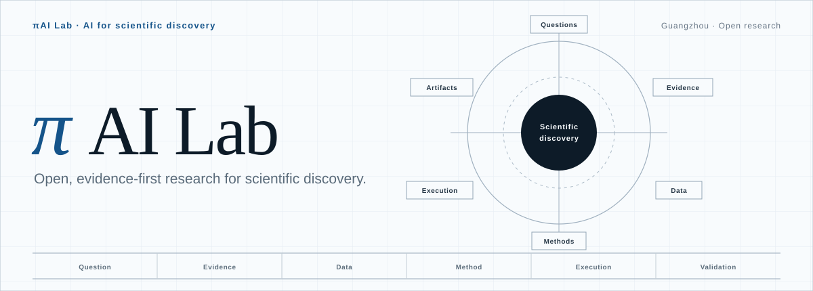

<picture>
  <source media="(prefers-color-scheme: dark)" srcset="./assets/hero-dark.svg">
  <source media="(prefers-color-scheme: light)" srcset="./assets/hero-light.svg">
  
</picture>

 

**OPEN RESEARCH · EVIDENCE FIRST · REPRODUCIBLE · RESEARCHER LED**

## Our position

πAI Lab is a public research and open-technology initiative based at 广东智慧医学国际研究院 in Guangzhou. We study how AI can support scientific discovery, with an initial focus on biomedical research. Our work is developed in the open and evaluated in real research settings.

## Research focus

- **Scientific evidence:** making literature, patents, data, methods, and claims easier to trace, examine, and reuse.
- **Reliable research workflows:** improving provenance, evaluation, reproducibility, recovery, and human oversight in AI-assisted research.
- **Scientific communication:** creating clear, editable, and verifiable research artifacts without separating presentation from evidence.
- **Biomedical research:** testing ideas against demanding, real-world questions in medicine and life science.

## How we work

**OPEN RESEARCH — Share what can be responsibly shared.** Public work should have a clear scientific purpose, accountable maintainers, explicit licensing, and a credible maintenance path.

**EVIDENCE FIRST — Keep claims connected to their basis.** Sources, versions, assumptions, limitations, environments, and failures should remain inspectable.

**REPRODUCIBLE — Treat evaluation as part of the research.** We value documented methods, transparent benchmarks, failure analysis, and validation in real settings.

**RESEARCHER LED — Scientists retain final judgment.** Research direction, interpretation, validation, and release remain human responsibilities.

Unless a repository states otherwise, public work in this organization should be understood as research-stage rather than production, clinical, legal, or regulatory validation.

## Collaboration

We welcome research collaborations around scientific evidence, reliable AI-assisted research, scientific communication, evaluation and reproducibility, biomedical research, and cross-disciplinary transfer.

**Contact:** [liuzaoqu@163.com](mailto:liuzaoqu@163.com)

[`Governance`](../GOVERNANCE.md) · [`Project policy`](../PROJECT_POLICY.md) · [`Contributing`](../CONTRIBUTING.md) · [`Security`](../SECURITY.md) · [`Support`](../SUPPORT.md)

---

<strong>中文摘要</strong>

### πAI Lab · 面向科学发现的开放研究

πAI Lab 是设在广东智慧医学国际研究院的公共研究与开放技术计划。我们关注人工智能如何支持科学发现，当前主要从真实生物医学研究出发，在开放协作中开展工作，并在真实研究场景中检验其价值。

- **科学证据：** 让文献、专利、数据、方法与研究主张更容易被追溯、检验和复用。
- **可靠科研流程：** 重视 AI 辅助研究中的溯源、评测、可复现性、失败分析与人的监督。
- **科研表达：** 让研究图表、插图和文档保持清晰、可编辑、可核验，不让表达与证据脱节。
- **生物医学研究：** 把方法放到真实、复杂的医学与生命科学问题中检验。

我们坚持开放研究、证据优先、可复现以及研究者主导。来源、版本、假设、局限与失败应当可以被检查；研究方向、证据判断、实验验证与最终发布仍由科学家负责。

除非具体仓库另有说明，本组织公开的工作应视为研究阶段成果，不代表已达到生产、临床、法律或监管验证状态。

科研合作：[liuzaoqu@163.com](mailto:liuzaoqu@163.com)

